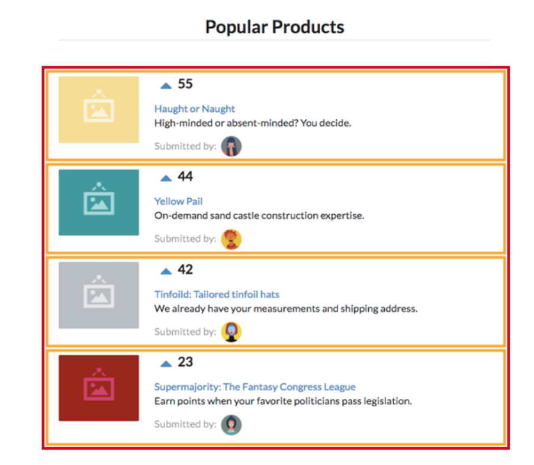

### Audience

### What is React
    - A view layer
    - declerative
    - component based
    - Learn once, write anywhere (Examples & Ref Sites)
    - Virtual DOM
    
### Attaching App to the DOM [[Official Doc]](https://reactjs.org/docs/rendering-elements.html)
    - 0.HelloWorld
    - Component (functional or Class based)
        > Components let you split the UI into independent, reusable pieces, and think about each piece in isolation.
        > Conceptually, components are like JavaScript functions. They accept arbitrary inputs (called “props”) and return React elements describing what should appear on the screen.

### Props [[Official Doc]](https://reactjs.org/docs/components-and-props.html)
    - 1.Greeting
    - Composing Components
    - Props are read only
    - All React components must act like pure functions with respect to their props.
   
### State [[Official Doc]](https://reactjs.org/docs/state-and-lifecycle.html)
    - Component can manage it's own state
    - Class based component
    - Lifecycle methods
    
### Thinking in React [[Official Doc]](https://reactjs.org/docs/thinking-in-react.html)
#### Step 1: Break The UI Into A Component Hierarchy    

    - FilterableProductTable (orange): contains the entirety of the example
    - SearchBar (blue): receives all user input
    - ProductTable (green): displays and filters the data collection based on user input
    - ProductCategoryRow (turquoise): displays a heading for each category
    - ProductRow (red): displays a row for each product
#### Step 2: Build A Static Version in React
#### Step 3: Identify The Minimal (but complete) Representation Of UI State
#### Step 4: Identify Where Your State Should Live
#### Step 5: Add Inverse Data Flow
    
### Voting App

